# Jmix Bookstore

  

Jmix Bookstore is an example application built with Jmix framework. It implements the use-cases of a imaginary retail business company that focuses on shipping books throughout the US.

The application uses the following add-ons:

* Reports
* Email
* data-tools
* BPM (premium)
* Notifications (premium)

## Online Demo

The demo of the Jmix Bookstore is available at https://demo.jmix.io/bookstore

## Application Overview

## Business Domain

Jmix Bookstore is a retail bookstore, that ships books to customers. The single distribution channel is phone. Customers call in and can order books directly from the phone, without any need to use a computer. They simply speak to a person that takes their orders and makes sure the correct book lands at their doorsteps. To achieve this mission, the Jmix Bookstore application supports all departments in their use-cases. The company contains of the following departments:

* Order Fulfillment
* Procurement
* Sales
* IT

We will highlight the main business cases of the corresponding departments that are supported by the application.

### Sales

The sales team is the main interaction point with the customers. The customer calls to place an order. The sales employees are taking over this responsibility. The company splits the customers into different territories. Each sales team member is then responsible for one or more territories: 

* `Lois Marsh` responsible for all territories in regions "US-South" and "US-East".
* `Jessica Musgrave` responsible for all territories in the regions "US-North" and "US-West".

#### Placing Customer Orders

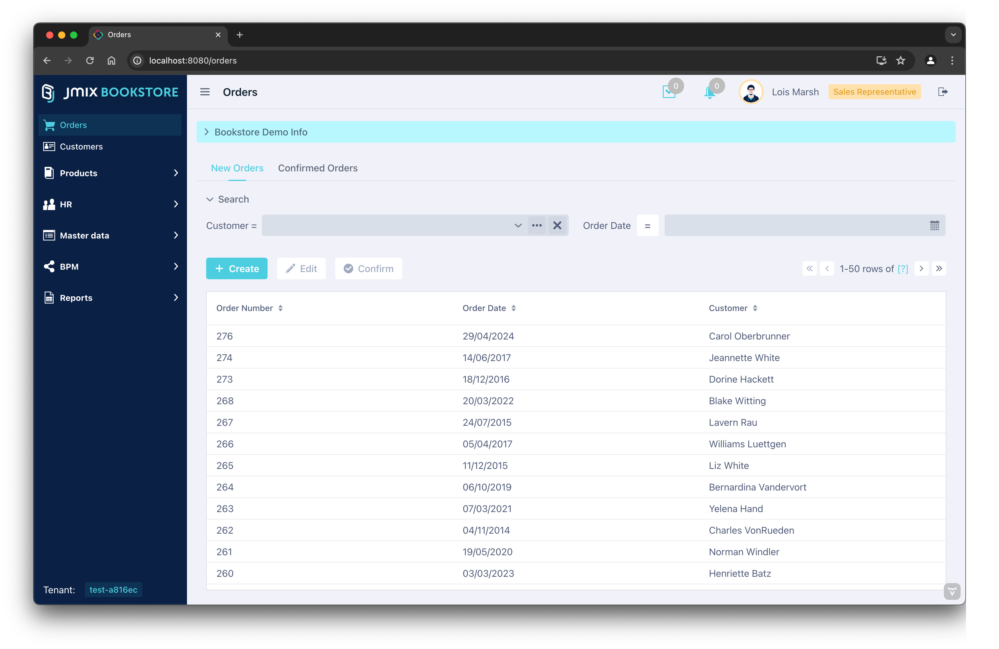

When a customer calls and wants to order some books, the order fulfillment specialists us the ability of the system to place orders. They search for the customers by first name / lastname and optionally create a customer record for new customers.

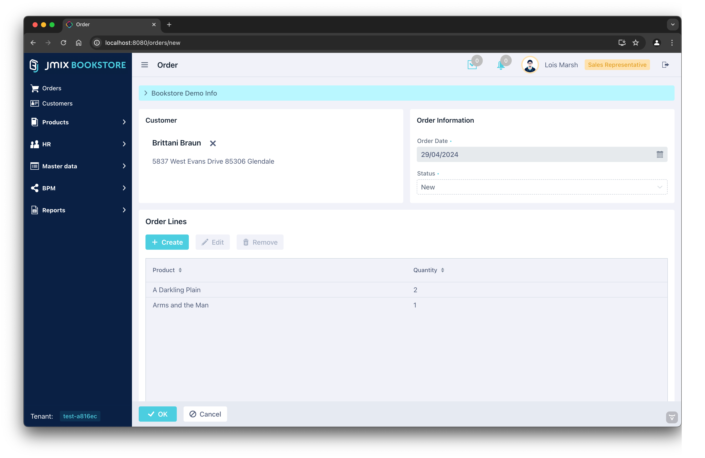

After that, they collect the books that the customer would like to order, the quantity and let the customer know about the price of a particular book and the overall order.

Placed orders will be picked up by the order fulfillment employees to confirm the customer order (see: [Order Fulfillment > Confirming Customer Orders](#confirming-customer-orders)). When an order is confirmed by their colleges, the sales employee gets a notification to keep track of which orders need further clarification or where the customer needs to be contacted (see: [Functionalities > Notifications](#notifications)). 

### Order Fulfillment

The order fulfillment department consists of three employees: `Melissa Arendt` and `Hikari Miyama` as order fulfillment specialists as well as `Adrian Adams` being a order fulfillment manager.

They together are responsible for making sure the orders, created by the sales folks are correct and can be fulfilled. Sometimes they see that particular books are low in stock. So they indicate to the procurement department that a book is getting out-of-stock, so that the colleges can order new books from the suppliers.

#### Confirming Customer Orders

Once the order is placed by the sales department, it needs to be confirmed by the fulfillment employees. During the confirmation, the distribution center that should fulfill the order is selected. The system gives recommendations, but ultimately it is up to the order fulfillment specialist to decide which is the distribution center that fulfills the order. The main decision factor is the proximity between the fulfillment center and the shipping address, but other factors like amount of stock is also considered.

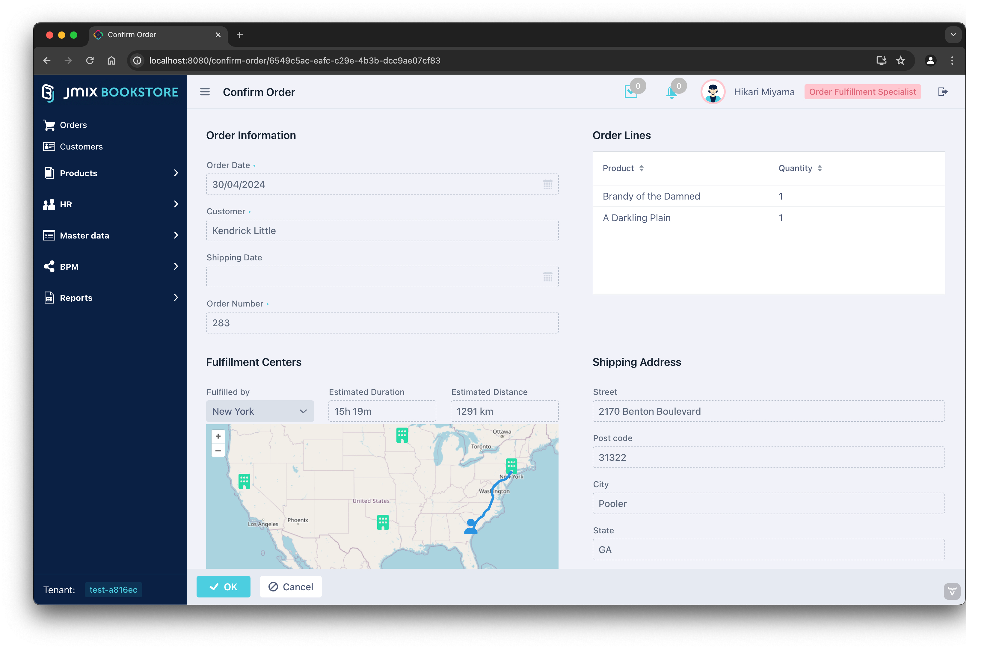

#### Perform Fill-up requests

After a customer placed an order, the order fulfillment specialist checks about the remaining amount of stock for a book. In case it goes below a threshold, they will request a fill-up for this book in the inventory. During that process, the procurement employees are notified (see: [Functionalities > Notifications](#notifications)), so that they can start the work on performing supplier orders.

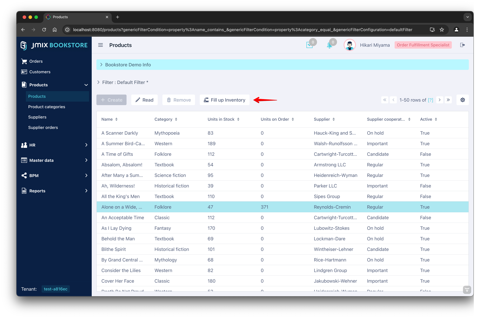

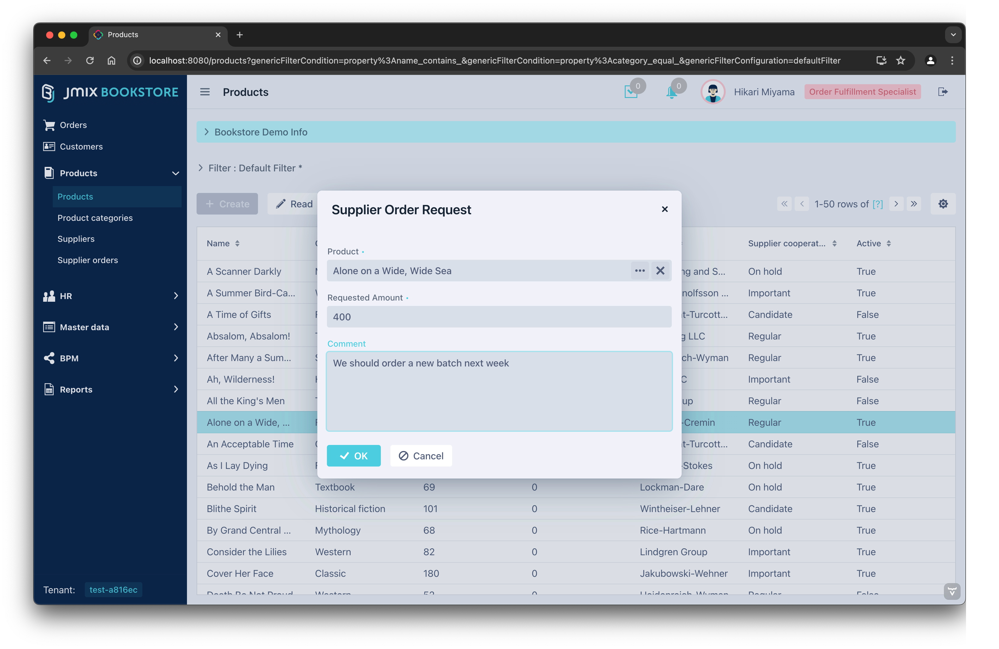

### Procurement

The employees of the procurement department are: `William Linville` and `Sophia Burnett`. `Nicole Berry` is their manager.

The responsibility of the procurement team is to perform supplier orders to fill up the stock of books. Besides that they are also in charge of managing the book catalog.

#### Place Supplier Orders

When a fill-up requests comes from the order fulfillment employees, William and Sophia are supposed to trigger a supplier order. They normally do that on mondays. Over the week the system collects the fill-up requests and groups them by suppliers, so that an aggregated supplier order can be placed.

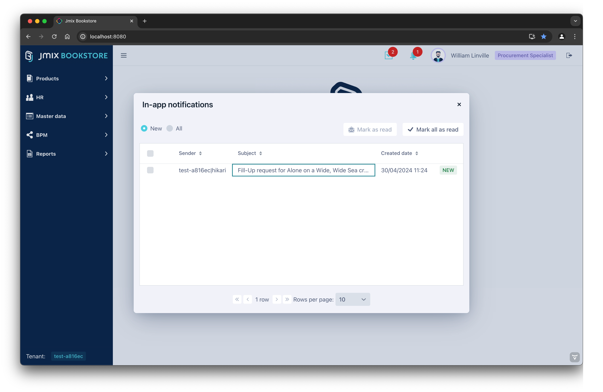

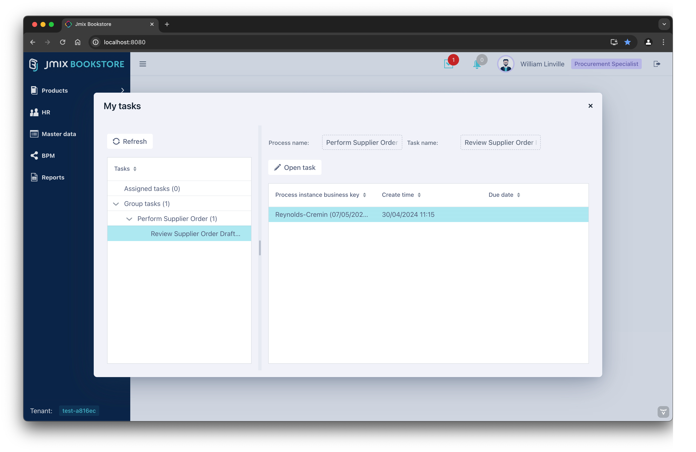

The procurement specialist reviews the aggregated requests and can potentially make adjustments regarding the total amount of books or adding / removing particular books from the supplier order.

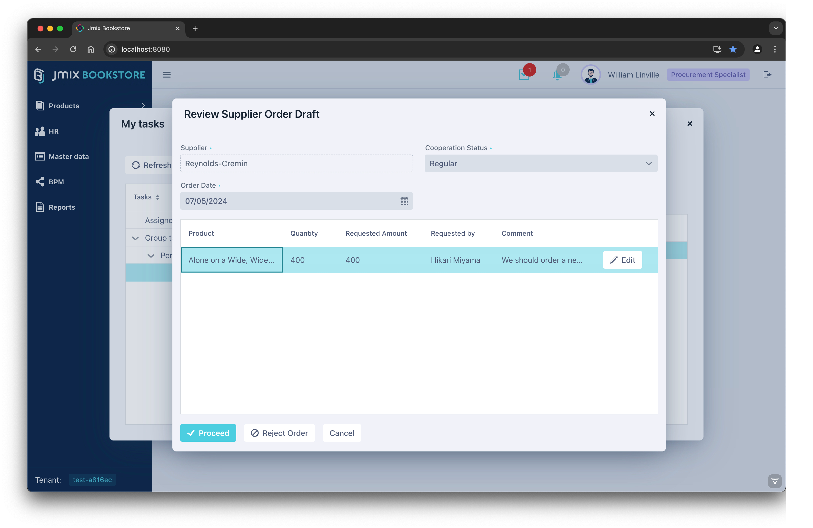

Once the review is finished, sometimes an approval is required. The system decides based on cooperation status with that supplier if the order is send for approval to the procurement manager.

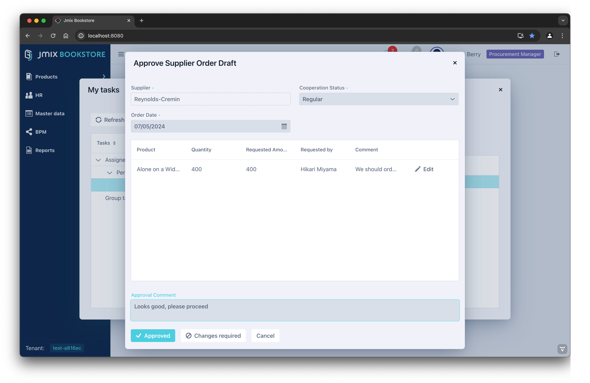

This business process is implemented using the BPM add-on (see: [Functionalities > BPM](#BPM)).

Finally, after optionally approving the supplier order, a supplier order is placed. The system sends out an automated email containing all relevant information to the configured supplier email address. (see: [Functionalities > Email](#email)).

#### Managing Product Catalog

The second responsibility is to manage the product catalog of books. For this the procurement employees the application provides UIs to add books to the product catalog as well as removing them from the listing. 

### IT

The IT department of the company consists of a single person: `Mike Holloway`. He is taking care of managing the master data of the system as well as providing system access for employees.

#### Managing System Access

In order to ensure that every employee has access to the system functionalities they need in order to fulfill their duties, Mike empowers employees to have access to the system. For this he manages employee records and users. He also assigns them to the corresponding positions & roles in the company and optionally their associated territories. With that, the employees are able to access the parts of the system and the associated data.

As (data) security is a very important to the company, the data the employees see is strictly restricted to their area of work. E.g. sales employees can only see customers and orders of their associated territories. Additionally, they are only allowed to create orders and customers, but not products or territories. This role management and assignment is performed by Mike as his work as the IT administrator.

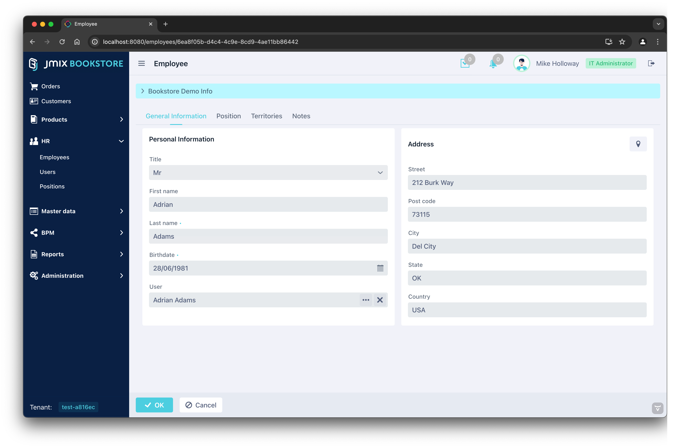

#### Master data management

Particular data that changes very infrequent and acts as master data for other parts of the system is also managed by the IT department. This includes the Regions, Territories as well as the fulfillment centers the company operates.

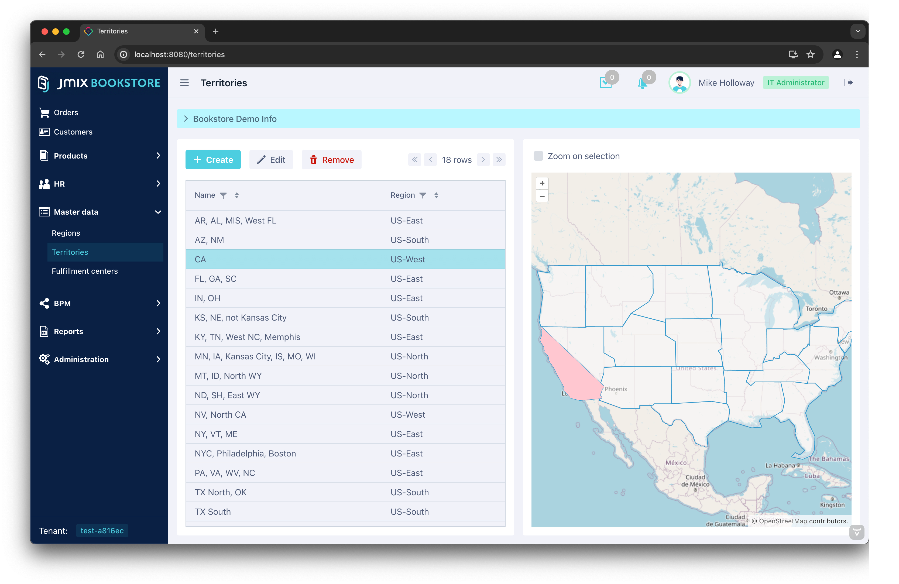

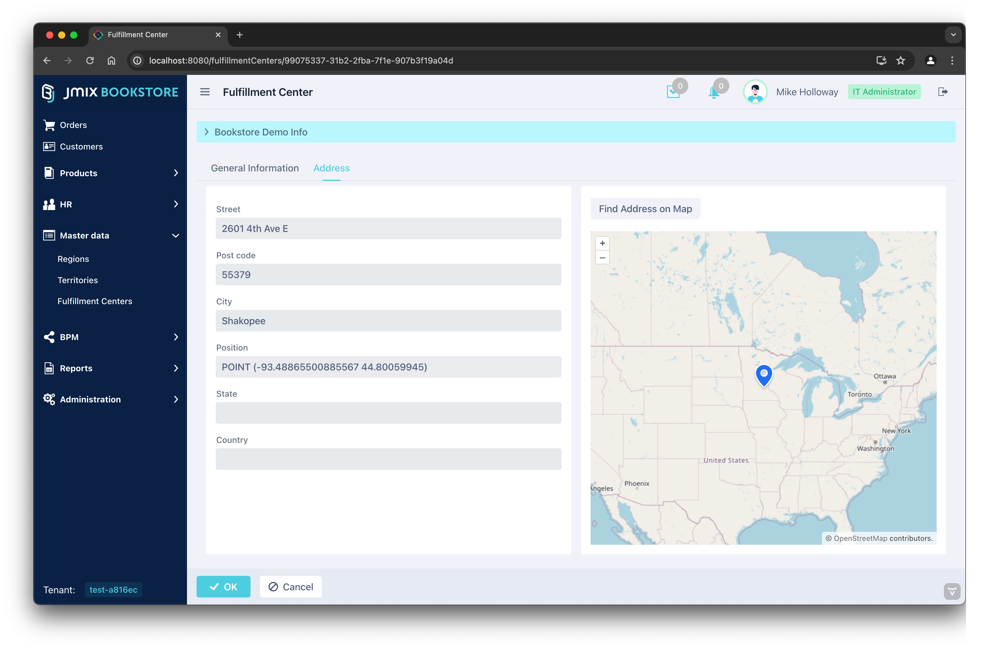

## Functionalities

### BPM

### Notifications

### Email

### Reports
